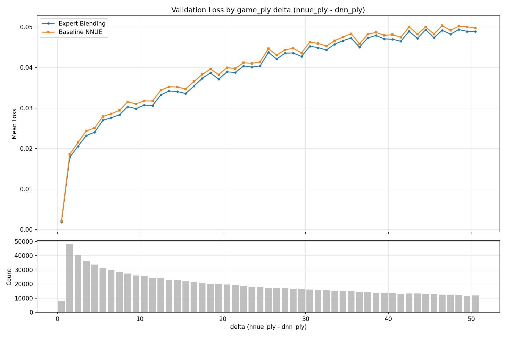
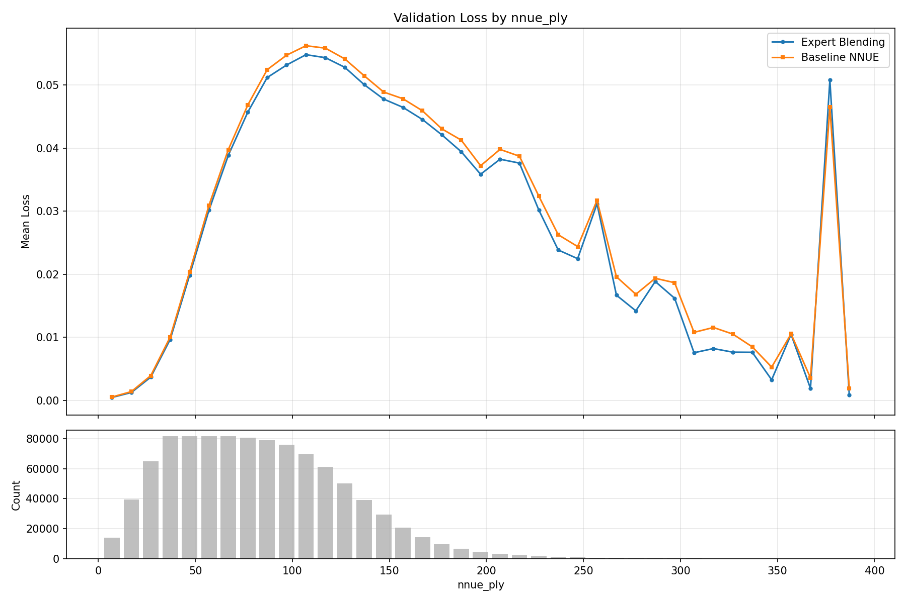

# game_plyの差によるlossの違いの検証 (NNUEバックボーン)

Expert Blending (NNUEバックボーン, checkpoint 500) とベースライン単一NNUEの validation loss を
`delta = nnue_ply - dnn_ply` および `nnue_ply` でbin分割して比較した。

## 実行コマンド

```bash
cd nnue-pytorch && source .venv/bin/activate
PYTHONPATH=../src:$PYTHONPATH python -u -m train_nnue.check_loss_per_gameply \
    --expert-blending-checkpoint /home/select766/shogi/train-nnue/logs/expert_blending_8experts_v4_paired_uniform50_nnue_backbone_noise0/checkpoints/500.ckpt \
    --nnue-checkpoint /home/select766/shogi/modelarchive/train-tanuki/83000.ckpt \
    --val-dir /home/select766/shogi/train-nnue/dataset/split_v1_paired_uniform_50/val1 \
    --feature-set HalfKP \
    --max-positions 1000000 \
    --output /home/select766/shogi/train-nnue/docs/check-loss-per-gameply-nnue-backbone/loss_per_gameply.png
```

- データ: `dataset/split_v1_paired_uniform_50/val1` の先頭100万レコード (40B/record ペア形式)
- Expert Blending (NNUEバックボーン): `logs/expert_blending_8experts_v4_paired_uniform50_nnue_backbone_noise0/checkpoints/500.ckpt`
- ベースラインNNUE: `modelarchive/train-tanuki/83000.ckpt`

## 結果

### delta (nnue_ply - dnn_ply) 別



| delta | EB_loss | BL_loss | count |
|------:|--------:|--------:|------:|
| 0.5 | 0.001817 | 0.002035 | 8172 |
| 1.5 | 0.017837 | 0.018547 | 48334 |
| 2.5 | 0.020570 | 0.021518 | 40240 |
| 3.5 | 0.023198 | 0.024350 | 36180 |
| 4.5 | 0.024012 | 0.025063 | 33769 |
| 5.5 | 0.026958 | 0.027907 | 31271 |
| 6.5 | 0.027591 | 0.028596 | 29826 |
| 7.5 | 0.028313 | 0.029401 | 28300 |
| 8.5 | 0.030349 | 0.031527 | 27342 |
| 9.5 | 0.029848 | 0.031011 | 26009 |
| 10.5 | 0.030726 | 0.031775 | 25415 |
| 11.5 | 0.030600 | 0.031715 | 24391 |
| 12.5 | 0.033232 | 0.034400 | 24053 |
| 13.5 | 0.034197 | 0.035276 | 23002 |
| 14.5 | 0.034085 | 0.035159 | 22538 |
| 15.5 | 0.033570 | 0.034722 | 21914 |
| 20.5 | 0.038959 | 0.039966 | 19580 |
| 25.5 | 0.043769 | 0.044674 | 17174 |
| 30.5 | 0.045260 | 0.046292 | 16159 |
| 35.5 | 0.047274 | 0.048387 | 14898 |
| 40.5 | 0.046993 | 0.048128 | 13777 |
| 45.5 | 0.047383 | 0.048296 | 12647 |
| 50.5 | 0.048907 | 0.049800 | 11922 |

- 全delta帯でExpert Blending (NNUEバックボーン) がベースラインより低いloss
- DNNバックボーン版と比較して改善幅は小さい（約0.001程度の差）
- delta増大に伴うloss増加傾向はDNNバックボーン版と同様

### nnue_ply (絶対手数) 別



| nnue_ply | EB_loss | BL_loss | count |
|---------:|--------:|--------:|------:|
| 7 | 0.000489 | 0.000556 | 14028 |
| 17 | 0.001270 | 0.001415 | 39585 |
| 27 | 0.003709 | 0.003943 | 64871 |
| 37 | 0.009671 | 0.010059 | 81556 |
| 47 | 0.019825 | 0.020381 | 81415 |
| 57 | 0.030155 | 0.030928 | 81378 |
| 67 | 0.038864 | 0.039767 | 81490 |
| 77 | 0.045682 | 0.046814 | 80431 |
| 87 | 0.051167 | 0.052418 | 78999 |
| 97 | 0.053153 | 0.054712 | 75942 |
| 107 | 0.054791 | 0.056210 | 69571 |
| 117 | 0.054317 | 0.055827 | 61200 |
| 127 | 0.052789 | 0.054125 | 50152 |
| 137 | 0.050045 | 0.051454 | 39236 |
| 147 | 0.047764 | 0.048879 | 29447 |

- 全ply帯でExpert Blending (NNUEバックボーン) がベースラインより低いloss
- 改善幅はply 90~120 (中盤) で最大（約0.0015の差）
- DNNバックボーン版（改善幅 最大約0.008）と比較して改善幅は大幅に小さい
