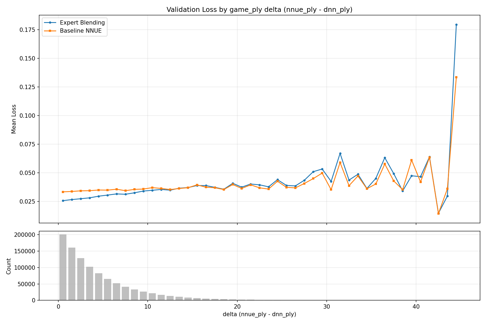
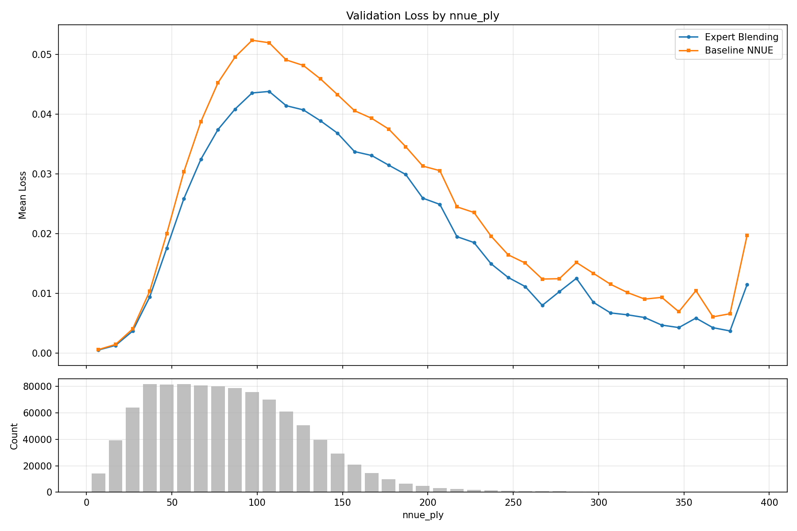

# game_plyの差によるlossの違いの検証

Expert Blending (checkpoint 160) とベースライン単一NNUEの validation loss を
`delta = nnue_ply - dnn_ply` および `nnue_ply` でbin分割して比較した。

## 実行コマンド

```bash
cd nnue-pytorch && source .venv/bin/activate
PYTHONPATH=../src:$PYTHONPATH python -u -m train_nnue.check_loss_per_gameply \
    --expert-blending-checkpoint /home/select766/shogi/train-nnue/logs/expert_blending_8experts_v4_paired_noise0/checkpoints/160.ckpt \
    --nnue-checkpoint /home/select766/shogi/modelarchive/train-tanuki/83000.ckpt \
    --val /home/select766/shogi/train-nnue/dataset/split_v1_paired/train.bin \
    --feature-set HalfKP \
    --max-positions 1000000 \
    --output /home/select766/shogi/train-nnue/docs/check-loss-per-gameply/loss_per_gameply.png
```

- データ: `dataset/split_v1_paired/train.bin` の先頭100万レコード (80B/record ペア形式)
- Expert Blending: `logs/expert_blending_8experts_v4_paired_noise0/checkpoints/160.ckpt`
- ベースラインNNUE: `modelarchive/train-tanuki/83000.ckpt`

## 結果

### delta (nnue_ply - dnn_ply) 別



| delta | EB_loss | BL_loss | count |
|------:|--------:|--------:|------:|
| 0.5 | 0.025630 | 0.033337 | 200979 |
| 1.5 | 0.026578 | 0.033673 | 160658 |
| 2.5 | 0.027321 | 0.034220 | 128281 |
| 3.5 | 0.028115 | 0.034329 | 102477 |
| 4.5 | 0.029546 | 0.034938 | 82175 |
| 5.5 | 0.030500 | 0.034826 | 65496 |
| 6.5 | 0.031530 | 0.035630 | 52495 |
| 7.5 | 0.031221 | 0.034346 | 41349 |
| 8.5 | 0.032491 | 0.035486 | 33368 |
| 9.5 | 0.034019 | 0.035775 | 26496 |
| 10.5 | 0.034697 | 0.037013 | 21353 |
| 11.5 | 0.035420 | 0.036313 | 17150 |
| 12.5 | 0.034805 | 0.035323 | 13716 |
| 13.5 | 0.036531 | 0.036263 | 10725 |
| 14.5 | 0.037075 | 0.036941 | 8816 |

- delta 0~13: Expert Blendingがベースラインより明確にlossが低い
- delta 14付近で両者がほぼ同等
- delta 15以降はサンプル少だがExpert Blendingのlossがやや高くなる傾向

### nnue_ply (絶対手数) 別



| nnue_ply | EB_loss | BL_loss | count |
|---------:|--------:|--------:|------:|
| 7 | 0.000518 | 0.000588 | 14271 |
| 17 | 0.001287 | 0.001449 | 39373 |
| 27 | 0.003678 | 0.004034 | 64170 |
| 37 | 0.009375 | 0.010351 | 81808 |
| 47 | 0.017579 | 0.019997 | 81460 |
| 57 | 0.025831 | 0.030332 | 81645 |
| 67 | 0.032440 | 0.038741 | 80901 |
| 77 | 0.037406 | 0.045242 | 80128 |
| 87 | 0.040830 | 0.049538 | 78850 |
| 97 | 0.043537 | 0.052351 | 75838 |
| 107 | 0.043786 | 0.051933 | 70055 |
| 117 | 0.041400 | 0.049060 | 61014 |
| 127 | 0.040703 | 0.048141 | 50543 |
| 137 | 0.038886 | 0.045895 | 39733 |
| 147 | 0.036810 | 0.043257 | 29138 |

- 全ply帯でExpert Blendingがベースラインより低いloss
- 改善幅はply 60~120 (中盤) で最大
- 対局での弱さの原因はloss以外にある可能性が高い
