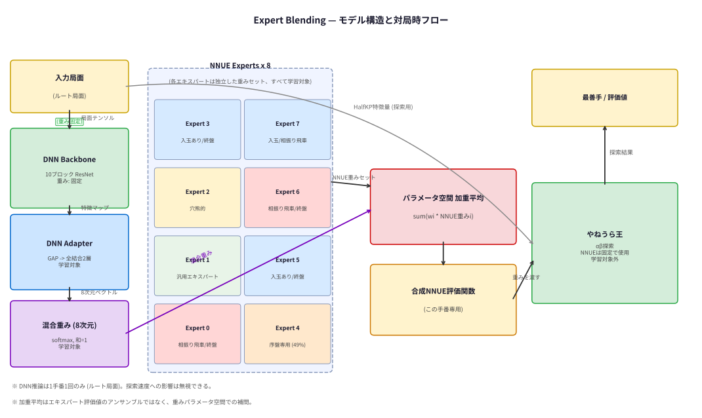
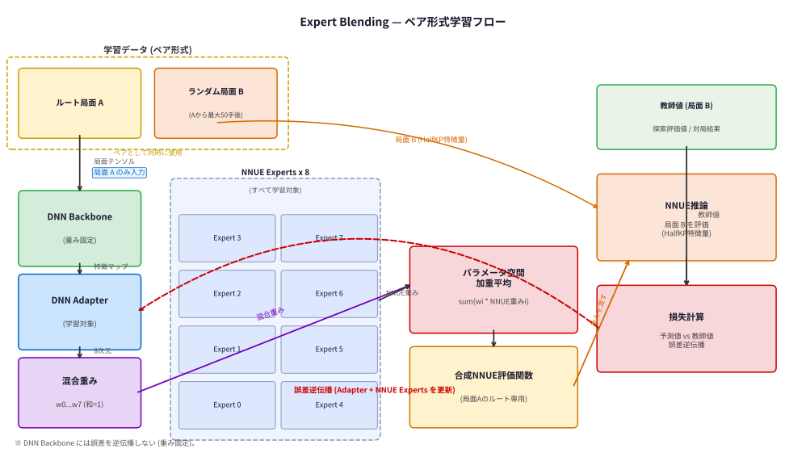
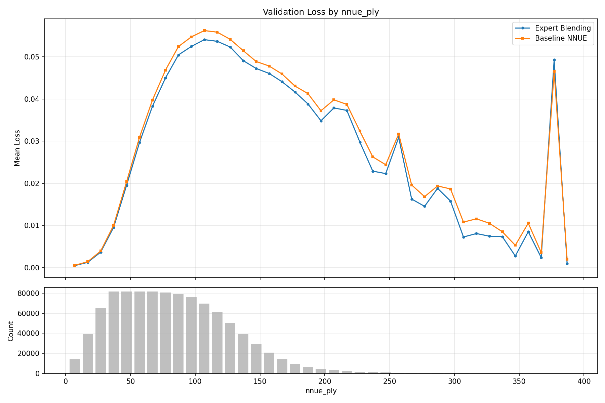

# ねね将棋 WCSC36 アピール文書

**開発者**: 日高雅俊  
**作成日**: 2026年4月29日

---

## 概要

ねね将棋は **Expert Blending（エキスパートブレンディング）** と呼ぶ手法を用いた将棋 AI である。
局面の性質を DNN で認識し、局面ごとに異なる評価関数を動的に生成して探索に用いる。

---

## コンピュータ将棋ファン向け概要

### 背景

コンピュータ将棋には **進行度** という概念がある。対局開始を 0%、終局（詰み）を 100% とした場合に、現局面がどの段階にあるかを表す値であり、進行度によって評価関数を切り替えるソフトが存在する。

また、同じ構造を持ちながら学習条件が異なる複数の評価関数について、学習済み重みを重み付け和して新たな評価関数を生成する技法がある。将棋 AI の分野では **評価関数のキメラ** と呼ばれ、LLM 分野の **モデルマージ** に相当する手法である。

### 提案手法: Expert Blending

本研究では **多次元の進行度** を定義し、局面ごとに異なる重み付けで評価関数のキメラを生成する。

従来の「序盤→終盤」という 1 次元ではなく、**戦型・入玉の有無・手数・評価値の差** など局面の性質を多角的に捉えた多次元の特徴量を「進行度」として扱う。その進行度に応じて適したエキスパート（専用評価関数）を選ぶ。

具体的な動作フロー：

1. **局面特徴の抽出**: 学習済みの ResNet ベース DNN（10 ブロック CNN）に局面を入力し、高次の特徴量を抽出する
2. **混合重みの計算**: DNN の末端にアダプタ（小さなネットワーク）を接続し、8 つのエキスパートへの混合重みを計算する
3. **評価関数の合成**: 混合重みに従い、8 つの NNUE 評価関数の重みパラメータを加重平均して 1 つの評価関数を生成する
4. **探索実行**: やねうら王に出来上がった NNUE 評価関数を読み込ませて探索を行う

手番 1 回に対して同じ評価関数を使用し、次の手番が来たら新しく評価関数を生成し直す。DNN 推論は 1 手あたり 1 回だけのため、探索速度への影響は無視できる。



---

## 機械学習エンジニア向け詳細

### アーキテクチャ

本手法は **Hypernetworks** の考え方に基づく。Hypernetwork とは、メインネットワークの重みを出力するネットワークである。本研究では「局面の特徴に応じた NNUE 評価関数の重みを生成するネットワーク」として、DNN アダプタが Hypernetwork の役割を担う。

モデルは 3 つのコンポーネントから構成される。

| コンポーネント | 役割 | 学習 |
|---|---|---|
| DNN Backbone | 局面テンソルから高次特徴量を抽出（10 ブロック ResNet） | 固定 |
| DNN Adapter | Backbone 出力から 8 次元の混合重み（softmax）を計算 | 学習対象 |
| NNUE Experts × 8 | 独立した 8 セットの NNUE（HalfKP 256×2-32-32）重みパラメータ | 学習対象 |

推論の流れを疑似コードで示す。

```python
feat   = DNN_backbone(state_tensor)          # 重み固定
weight = softmax(DNN_adapter(feat) + noise)  # 混合重み (8次元, 和=1)
                                             # noise は学習時のみ加算（退化防止）
nnue_w = sum(weight[i] * NNUE_weight[i]      # 重みパラメータ空間での加重平均
             for i in range(8))
value  = NNUE(state_kp, nnue_w)             # NNUE 推論
```

**重要**: ここでの加重平均は各エキスパートの出力値のアンサンブルではなく、**重みパラメータ空間での補間**である。8 つの離散エキスパートでは表現できない中間的な評価関数も生成できる。

### 学習方法

重要なポイントとして、混合重みを決定するのは **ルート局面** であるが、探索ではその数十手先の末端局面での評価値が正しいことが求められる。

ルート局面のみで損失を計算すると、「ルート局面の評価だけが正しく、探索先の局面では的外れな評価をするモデル」が学習される危険がある。これを防ぐため、**ペア形式の学習データ**を採用した。

- 各訓練サンプルは「ルート局面 A」と「そこから最大 50 手後のランダムな局面 B」のペア
- DNN 推論はルート局面 A のみで行い、混合重みを決定する
- 損失は、生成した NNUE 評価関数で局面 B を評価した値と教師値の乖離で計算する

これにより、ルート局面の情報から先読みの評価も正確な評価関数を生成するよう end-to-end に学習される。



---

## 結果

### エキスパートの自動分類

学習後、検証データ 10,000 局面に対して 8 つのエキスパートへの担当を割り当てたところ（`argmax` によって最も重みの高いエキスパートを担当とする）、明確な特性の違いが確認された（表 1）。エキスパートの特性は手動で設定したものではなく、**学習により自動的に形成**された。

**表 1: エキスパートの特性（自動ラベル）**

| エキスパート | 担当局面数 | 担当割合 | 平均手数 | 自動ラベル |
|:-----------:|----------:|--------:|--------:|-----------|
| 0 | 98 | 1.0% | 132 手 | 相振り飛車 (3.0×) / 終盤 (2.7×) |
| 1 | 1,302 | 13.0% | 79 手 | （汎用エキスパート） |
| 2 | 847 | 8.5% | 112 手 | 穴熊的 (先手 1.9× / 後手 2.1×) |
| 3 | 630 | 6.3% | 126 手 | 入玉あり (3.4×) / 終盤 (2.3×) |
| **4** | **4,939** | **49.4%** | **52 手** | **序盤 (2.0×)** |
| 5 | 825 | 8.3% | 122 手 | 入玉あり (2.5×) / 終盤 (2.3×) |
| 6 | 538 | 5.4% | 116 手 | 相振り飛車 (2.5×) / 終盤 (2.1×) |
| 7 | 821 | 8.2% | 135 手 | 入玉あり (4.2×) / 相振り飛車 (2.3×) |

括弧内の倍率は **lift 値**（そのエキスパートが担当する局面における特徴の出現率 ÷ 全局面での出現率）を示す。値が大きいほど、そのエキスパートがその特徴を持つ局面を優先的に担当していることを意味する。

注目すべき点：

- **エキスパート 4（序盤専用）** が最多の局面を担当（49%）。序盤に特化したエキスパートが自然に形成された
- **入玉専用エキスパート**（3, 5, 7）が複数形成された。入玉局面は通常の将棋と大きく性質が異なるため、専用の評価関数が必要であることを自動的に発見したと解釈できる
- **相振り飛車専用エキスパート**（0, 6）が形成された
- **穴熊的局面専用エキスパート**（2）が形成された

### 評価損失の比較

全手数帯にわたってベースライン単一 NNUE よりも低いバリデーション損失を達成した（図 3）。改善幅は中盤（手数 70〜120）で最大となり、約 4〜5% の損失改善が見られた。



**図 3**: 手数別バリデーション損失。Expert Blending（青）がベースライン単一 NNUE（橙）を全手数帯で下回っている。

### 最善手一致率

テスト局面 1,000 件に対して、Floodgate 棋譜の最善手との一致率を計測した（探索ノード数 100 万）。

| システム | 最善手一致率 |
|---------|------------:|
| Expert Blending | **64.7%** |
| ベースライン NNUE（たぬき） | 64.4% |
| Suisho5 | 60.2% |

評価損失では明確な改善が確認された一方で、実際のソフト間対戦での勝率向上は確認できていない。原因として、損失の改善が実際の最善手選択に直結しないケースがあること、あるいはハイパーパラメータ調整の余地が残っていることが考えられる。今後の課題として引き続き原因を究明していく。

---

## その他

- **学習データ**: たぬきチームが提供する局面データを使用（[nodchip/tanuki-.nnue-pytorch-2024-07-30.1](https://huggingface.co/datasets/nodchip/tanuki-.nnue-pytorch-2024-07-30.1)）
- **DNN モデル**: 10 ブロック CNN（書籍「強い将棋ソフトの創りかた」のサンプルコード / dlshogi ベース）。局面を 8 方向に分類するだけならより小さなネットワークでも実現できる可能性が高い
- **学習環境**: nnue-pytorch を改造して GPU で学習
- **対局環境**: CPU のみ。DNN 推論はルート局面で 1 回だけ行い、その後の探索はやねうら王に委ねる。DNN 推論によるオーバーヘッドは小さい
- **探索部**: やねうら王（改造版）を使用

---

## おわりに

局面の性質を DNN で認識し、それに応じた NNUE 評価関数を動的に生成する Expert Blending を開発した。学習により、入玉専用・序盤専用・相振り飛車専用といったエキスパートが自動的に形成されることを確認した。評価損失の改善は確認できたものの、対局強度への転換という点で課題が残る。引き続き改善を進めていく。

---

*注: model_overview.png および training_flow.png は別途作成予定。*
